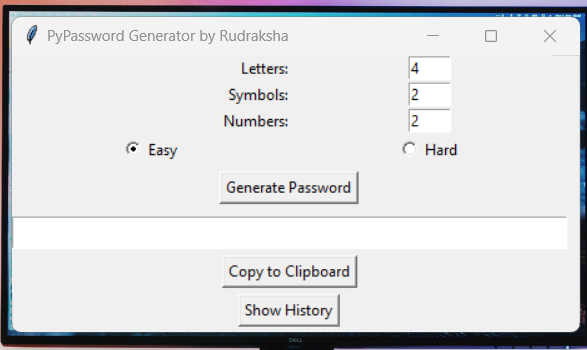
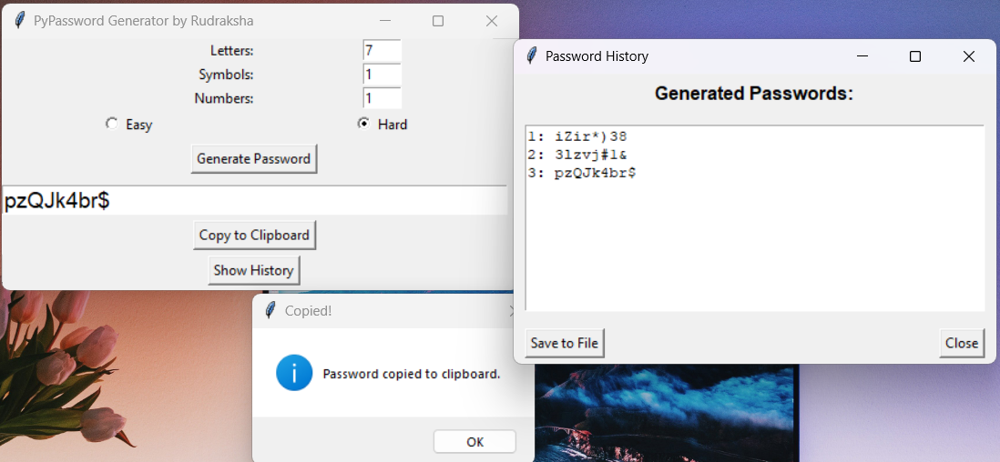

# 🔐 PyPassword Generator (GUI Version)

A powerful, customizable, and secure password generator built using Python and Tkinter.  
Easily create strong passwords with user-defined rules, copy them to your clipboard, and track your password history — all through a clean, responsive GUI.
<br>All generated passwords are also saved to a `.txt` file for future reference.

---

## 🚀 Key Features

- 🎯 Generate passwords with custom counts of:
  - 🔤 Letters
  - 🔢 Numbers
  - 🔣 Symbols
- 🔄 Choose between:
  - ✅ **Easy Mode** (ordered)
  - 🔀 **Hard Mode** (shuffled)
- 🖥️ GUI built using **Tkinter**
- 📋 One-click **clipboard copy**
- 🕘 **Typing animation** effect for enhanced UX
- 📜 View **password history** within the app
- 💾 **Export** history to a `.txt` file
- 🧠 Input validation and helpful error prompts

---

## 🖼️ Screenshots

### 💡 Main Application Interface


### 📜 Password History Window


---

## 🛠️ Tech Stack

- **Python 3.13.3**
- **Tkinter** – for GUI development
- Standard Libraries: `random`, `os`, `pyperclip`, `filedialog`, `sys`, `time`
- Packaging: `pyinstaller`

---

## 📦 Getting Started

### 🔧 Clone the Repository
```bash
git clone https://github.com/RDESHMUKHgit/PWDgenerator.git

```

### ▶️ Running the App
#### Option 1: Run the Executable
Navigate to the executable:
```bash
cd PWDgenerator/dist/
```
Then run:
```bash
./PWDgenerator.exe
```

#### Option 2: Using File Explorer (Beginner-Friendly)
Navigate to the `PWDgenerator` project directory using File Explorer. Then open the `dist` folder and double-click on `PWDgenerator.exe` to launch the application.

## 📜 License
Licensed under the MIT License. <br>
You're free to use, modify, and distribute it with attribution.

## 🙌 Acknowledgements
Special thanks to **ChatGPT for assistance** in:

- Implementing *clipboard* support

- *Refactoring* the codebase for readability

- Recommending user experience *UX enhancements* such as password history and export

## 💡 Future Ideas & Improvements
- 🔐 Password strength meter

- 🌙 Dark mode toggle

- 🧹 Auto-clear history option

- 🔒 Encrypted or password-protected history file

- 🎚️ Sliders instead of manual input for character counts

- 🔁 Generate multiple password options at once

- 👁️ Toggle visibility (Show/Hide passwords)

- 🎨 Improved visual design and interactive elements

---
## 📬 Contact
**Created by -** *Rudraksha Deshmukh*

Feel free to connect or reach out here:
- *Email:* rudraksha.d1234@gmail.com
- *LinkedIn:* www.linkedin.com/in/rdworks

---
---
#### *⭐️ If you found this helpful, give it a star and share it with others!*

> ThankYou
